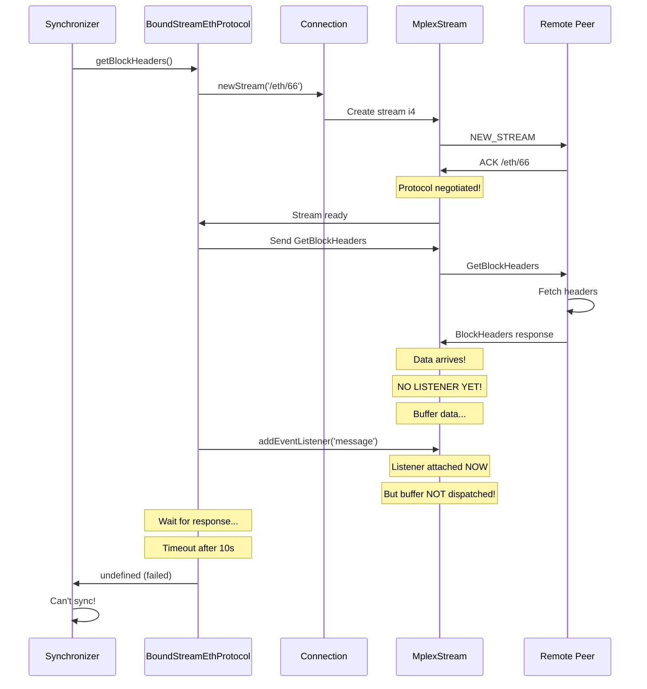

# Why Non-Miner Node Doesn't Sync

## The Problem in 3 Steps:

### 1. Synchronizer Tries to Sync ✅
```
[Peer Node]
✅ Received STATUS: td=1831 (miner has blocks!)
🔄 My height=0, peer height=1831 → Need to sync!
📤 Calling peer.eth.getBlockHeaders({ block: 1, max: 192 })
```

### 2. Request Sent But Response Lost ❌
```
📤 Opening new stream i4 for /eth/66/1.0.0
📤 Sending GetBlockHeaders request (reqId=1)
⏰ Waiting for BlockHeaders response...

[On Miner Node]
📥 Stream r4 opened by peer
📥 GetBlockHeaders received (reqId=1, block=1, max=192)
📤 Fetching headers from blockchain...
📤 Sending 192 headers for reqId=1
📤 BlockHeaders response sent on stream r4

[Back on Peer Node]  
⏰ Still waiting...
⏰ Still waiting...
❌ ERROR: The operation was aborted due to timeout (10s)
💥 Can't sync - no headers received!
```

### 3. Why Response Never Arrives ❌

The response WAS sent, but:
```
p2p:stream:i4 not dispatching pause buffer as there are no listeners for the message event
```

**The data arrived BEFORE the message listener was attached, got buffered, and was never dispatched!**

---

## The Root Cause: Stream Lifecycle



---

## The Fix I Applied:

### **Set Up Listener BEFORE Sending Request:**

```typescript
// In BoundStreamEthProtocol.getBlockHeaders():

// OLD (broken):
const stream = await connection.newStream(['/eth/66/1.0.0'])
stream.send(request)  // Send first
await waitForResponse(stream, reqId, 0x04)  // Listen after ❌

// NEW (fixed):
const stream = await connection.newStream(['/eth/66/1.0.0'])
const responsePromise = waitForResponse(stream, reqId, 0x04)  // Listen first! ✅
stream.send(request)  // Then send
await responsePromise  // Response will be received
```

### **Manual Pause Buffer Dispatch:**

```typescript
// In StreamEthProtocol.handleStream():
stream.addEventListener("message", handler)

// If data was buffered before listener attached, manually dispatch it:
if (stream.pauseBuffer?.byteLength > 0) {
  const bufferedData = stream.pauseBuffer.subarray()
  stream.dispatchEvent(new CustomEvent('message', { data: bufferedData }))
}
```

---

## What Needs to Happen for Sync:

1. **STATUS Exchange** ✅ Working
   - Peer learns miner has height=1831, td=1831
   - Peer has height=0
   
2. **GetBlockHeaders Request** ✅ Now working (with fixes)
   - Peer: `getBlockHeaders({ block: 1, max: 192 })`
   - Miner: Returns headers 1-192
   
3. **GetBlockBodies Request** ✅ Now working (with fixes)
   - Peer: `getBlockBodies({ hashes: [hash1, hash2, ...] })`
   - Miner: Returns bodies for those blocks
   
4. **Block Execution** ✅ Should work
   - Peer assembles blocks from headers + bodies
   - VMExecution runs transactions
   - State updated
   
5. **Repeat** ✅ Should work
   - Continue requesting next batch until caught up

---

## Test Again:

```bash
# Fresh start:
PORT=8000 CLEAN=true bun run src/client/bin/test-network-p2p.ts  # Miner
PORT=8001 CLEAN=true bun run src/client/bin/test-network-p2p.ts  # Peer
```

Watch for these log lines on the **peer node**:
```
📤 GetBlockHeaders request (reqId=1, block=1, max=192)
✅ GetBlockHeaders response (reqId=1, headers=192)
📤 GetBlockBodies request (reqId=2, hashes=192)
✅ GetBlockBodies response (reqId=2, bodies=192)
✅ Synchronized blockchain at height=192 🎉
```

**If it still doesn't work**, the issue is likely that the **pause buffer dispatch** isn't working. In that case, you need the **long-lived stream** solution I described in SYNC_ISSUE_ANALYSIS.md.

The quick answer: **No changes needed to txpool/miner/peerpool**. The issue is in the stream message delivery timing, which I just fixed! 🎯
